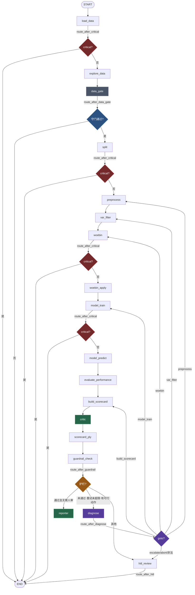

# credit_agent 架构说明 V2

> 目标：把 `credit_agent` 从「线性批处理流水线 + 一个人审按钮」升级为
> **具备自主决策闭环的建模 Agent**。
>
> 落地进度：**批次 A + B + C + D 全部完成**
> （A：模块 6 数据守门 + 错误短路 + 模块 4 校验层；
>   B：模块 1 诊断-重规划回路 + 模块 2 护栏失败分级自愈；
>   C：模块 5 cut-off 择优与可解释输出 + 模块 3 Reporter；
>   D：模块 3 Critic —— 三项确定性审计 + LLM 可降级复核）。
> 原方案中的模块 7（跨 thread 经验记忆）未纳入本轮，留作后续。

---

## 一、改造前后对比

| 维度 | v1（改造前） | 批次 A 后 | 批次 B 后 | 批次 C 后 | **批次 D 后（当前·终态）** |
|---|---|---|---|---|---|
| 节点数 | 14 | 15（+data_gate） | 16（+diagnose） | 17（+reporter） | **18**（+critic） |
| 条件边数 | 2 | 7 | 8（+diagnose 回跳） | 8（终局汇入 reporter，未新增条件边） | **8**（critic 不产生分支） |
| 是否有环 | ❌ 纯 DAG | ❌ | ✅ diagnose 回跳 | ✅ | ✅ |
| 护栏未通过 | 一律 HITL | 一律 HITL | 先自愈重试 ≤ max_retry 次 | 同左 | 同左 |
| **终局节点** | guardrail | guardrail | guardrail / hitl | 统一汇流到 reporter → END | 同左 |
| **交付物** | 评分卡 + 指标 | +守门结论 | +重规划履历 | +《模型开发报告》+ cut-off 建议 + 分档分布 | **报告扩到 13 章（新增第十一章 Critic 复核）** |
| LLM 参与点 | 仅 UI 按钮 | data_gate suggestion | +diagnose 决策（temperature=0） | +report 撰稿（禁写数字 + 泄漏拦截） | **+critic 复核（清单锚定 + 数字拦截）** |
| 错误短路 | ❌ | ✅ | ✅ | 同左 | 同左 |
| 数据质量守门 | ❌ | ✅ | ✅ | 同左 | 同左 |
| 自然语言配置 | ❌ | ✅ | ✅ | 同左 | 同左 |

---

## 二、当前拓扑（mermaid）



**闭环语义**：`diagnose` 只能回跳到 `allowed_goto` 白名单内的 5 个节点；
回跳时合并 `param_patch` 进 `config_overrides`，`retry_count += 1`；
达到 `max_retry` 或 `action ∈ {escalate, abort}` 则落到 `hitl_review`。

---

## 三、新增 state 字段

| 字段 | 类型 | 写模式 | 用途 |
|---|---|---|---|
| `diagnosis` | `dict` | 覆盖 | 最近一次诊断 `{action, goto, param_patch, reason, source}`，source ∈ `llm` / `llm(invalid)` / `rule` / `guard` |
| `retry_count` | `int` | **覆盖**（绝不可用 add） | 已自动重规划次数；用 add 会导致回跳重复累加 |
| `retry_history` | `Annotated[list[dict], add]` | 累积 | 每轮 `{round, action, goto, param_patch, reason, source, ks, auc, psi}` |
| `lgbm_model` | `Any` | 覆盖 | LGBM 对照模型（批次 B；**不替换评分卡主模型**） |
| `lgbm_metrics` | `dict` | 覆盖 | LGBM 对照的测试集 AUC/KS |
| `feature_importance` | `Any`(DataFrame) | 覆盖 | 【批次 C】LR+WOE「简化 SHAP」：`feature / coef / abs_coef / rank`，由 `tools.coefficient_importance` 算，不是 LLM 产出 |
| `scored_detail` | `Any`(DataFrame) | 覆盖 | 【批次 C】逐变量分值明细（`only_total_score=False`），用于《拒贷理由书》 |
| `cutoff_info` | `dict` | 覆盖 | 【批次 C】`optimize_cutoff` 结果：`{cutoff, approve_rate, bad_rate_after, capture_rate, ks_at_cutoff, lift, table}` |
| `score_grades` | `Any`(DataFrame) | 覆盖 | 【批次 C】测试集分档 `DataFrame[score, grade]`，A 最好 |
| `report_md` | `str` | 覆盖 | 【批次 C】《模型开发报告》全文 Markdown |
| `report_path` | `str` | 覆盖 | 【批次 C】报告落盘路径 `reports/model_report_<thread_id>.md` |
| `critic_findings` | `Annotated[list[dict], add]` | 累积 | Critic 规则发现（批次 D） |
| `critic_report` | `dict` | 覆盖 | Critic 汇总 `{passed, issues, source}`（批次 D） |
| `data_gate` | `dict` | 覆盖 | 数据守门结果 `{passed, blocks, warnings, stats, suggest_drop, applied_filters, suggestion}` |
| `critical_error` | `bool` | 覆盖 | 不可恢复节点失败标志，用于短路 |

---

## 四、新增 config 项

### `agent`（诊断-重规划，批次 B 启用）

| 键 | 默认 | 说明 |
|---|---|---|
| `max_retry` | 3 | 最多自动重规划次数，超限转人工 |
| `allow_llm_diagnosis` | true | false 时纯规则 |
| `allowed_params` | 16 项 | 允许 LLM/自然语言修改的参数白名单 |
| `allowed_goto` | 5 个节点 | 允许回跳的目标 |
| `param_bounds` | 见 yaml | 各参数合法区间，越界夹取 |
| `binning_method_choices` | 4 项 | 分箱算法枚举 |
| `missing_strategy_choices` | 5 项 | 缺失策略枚举 |

### `data_gate`（数据质量守门）

| 键 | 默认 | 说明 |
|---|---|---|
| `min_rows` | 1000 | 最小样本量 |
| `min_default_rate` | 0.005 | 违约率下限 |
| `max_default_rate` | 0.5 | 违约率上限 |
| `min_years` | 3 | 仅 `time_split=True` 时校验 |
| `max_missing_ratio` | 0.6 | 单列缺失率上限 |
| `max_identical_ratio` | 0.98 | 单一值占比上限 |

### `report`（报告与 cut-off，批次 C 启用）

| 键 | 默认 | 说明 |
|---|---|---|
| `generate_report` | true | 是否把报告写盘（false 时仍产出 `report_md` 到 state） |
| `report_dir` | `"reports"` | 落盘目录；相对路径统一挂到项目根，文件名 `model_report_<thread_id>.md` |
| `allow_llm_report` | true | false → 三段「分析」全部走确定性占位（离线可用） |
| `cutoff_method` | `ks` | cut-off 择优口径：`ks` / `approve_rate` / `bad_rate` |
| `cutoff_target` | `null` | 后两种口径需要（如 0.7 通过率 / 0.02 坏率） |

### `critic`（模型复核，批次 D 启用）

| 键 | 默认 | 说明 |
|---|---|---|
| `allow_llm_critic` | true | false → 只用规则结论（完全确定性） |
| `vif_threshold` | 10.0 | VIF > 该值判 `fail`（high），> 5 判 `warn`（mid） |
| `concentration_threshold` | 0.5 | 单一取值占比上限 |
| `concentration_cols` | null | null → 自动挑类别列；也可显式给列名清单 |
| `critic_top_features` | 10 | findings / 报告只保留前 N 项 |
| `critic_max_rows` | 20 | 报告第十一章 issues 明细表最大行数 |

### 其他

| 键 | 默认 | 说明 |
|---|---|---|
| `exclude_vars` | `[]` | 建模排除变量（自愈时可自动追加漂移变量） |
| `min_year` | `null` | 只用 ≥ 该年份数据 |
| `exclude_industries` | `[]` | 排除行业代码 |

---

## 五、新增文件 / 修改文件

### 新增

| 文件 | 作用 |
|---|---|
| `agent/routing.py` | 所有路由函数集中：`route_after_critical` / `route_after_data_gate` / `route_after_guardrail` / `route_after_diagnose` / `route_after_hitl` / `has_critical_error` |
| `agent/nl_config.py` | 自然语言 → config 解析（LLM + 规则双层）+ `validate_patch` 白名单校验 |
| `tests/test_data_gate.py` | 数据守门 + 短路测试（15 例） |
| `tests/test_nl_config.py` | NL 配置解析测试（19 例） |
| `tools/cutoff_tools.py` | 【批次 C】`optimize_cutoff` 网格择优 + `grade_scores` 分档（纯确定性） |
| `tools/report_tools.py` | 【批次 C】`render_model_report`（12 章，批次 D 扩到 **13 章**）/ `render_reject_letter`（负向贡献 top-k） |
| `tests/test_cutoff_tools.py` | 【批次 C】cut-off 与分档测试（19 例） |
| `tests/test_report_tools.py` | 【批次 C】报告渲染 + reporter_node 降级 + 段落解析（31 例）+【批次 D】Critic 章节渲染（4 例，共 35 例） |
| `tools/audit_tools.py` | 【批次 D】三项确定性审计：`compute_vif` / `check_coef_consistency` / `check_sample_concentration` |
| `tests/test_audit_tools.py` | 【批次 D】审计工具测试（26 例） |
| `tests/test_critic_node.py` | 【批次 D】Critic 节点：规则汇总 / LLM 降级 / item 对齐（27 例） |

### 修改

| 文件 | 改动 |
|---|---|
| `agent/state.py` | 新增 V2 字段（见第三节，含批次 B 的 `lgbm_model` / `lgbm_metrics`） |
| `agent/nodes.py` | 新增 `data_gate_node` / `diagnose_node`；`@safe` 支持 `critical=True`；新增 `_llm_text` / `_llm_json`（强制降级，支持 temperature）；`load_data` 默认编码改 `utf-8-sig`；**修复 preprocess 误处理 target 列**（cap 会把 1 压成 0.88） |
| `agent/graph.py` | 注册 data_gate / diagnose；4 条短路条件边；1 条守门条件边；guardrail 三岔路由；diagnose 回跳条件边 |
| `agent/routing.py` | 批次 B 增加 `_has_actionable_plan`（仅在 `allow_llm_diagnosis=false` 时预判，避免无谓回跳） |
| `agent/run.py` | 新增 `--ask`；打印 data_gate / diagnosis / retry_history / lgbm 对照 / critical_error |
| `app/llm/client.py` | `get_model` 支持 `temperature` / `timeout` 显式入参（诊断用 `temperature=0`） |
| `config/default_config.yaml` | 新增 `agent` / `data_gate` / `report` / `exclude_vars` / `min_year` / `exclude_industries` 段 |
| `tools/validation_tools.py` | 新增 `check_data_quality` / `diagnose_psi_sources`（均为确定性，可单测） |
| `tools/scorecard_tools.py` | `scorecard_ply` 默认 `replace_blank_na=False`（修 NaN 触发的 `float has no len()`） |
| `scripts/generate_test_data.py` | 修复 `--output` 未被打印（日志始终显示默认路径）的误导性输出 |
| `tools/__init__.py` | 导出新函数 |
| `tools/model_tools.py` | 【批次 C】新增 `coefficient_importance`（LR+WOE 用 abs(coef) 排序的「简化 SHAP」，替代 shap 依赖） |
| `tools/feature_tools.py` | 【批次 C】`var_filter` 捕获 scorecardpy 在 pandas 3.0 下的 `reset_index(name=...)` TypeError → 降级 `return_rm_reason=False` 自行推导剔除清单 |

### 【批次 C】cut-off 择优与可解释输出（模块 5）

| 产出 | 计算方 | 说明 |
|---|---|---|
| `optimize_cutoff` | `tools/cutoff_tools.py` | 在 1%~99% 分位网格上择优；语义 **拒绝 `score < cutoff`，通过 `score >= cutoff`** |
| `grade_scores` | `tools/cutoff_tools.py` | 默认四等频分位 → A/B/C/D，A 最好；支持自定义分界与标签 |
| `scored_detail` | `scorecard_ply(only_total_score=False)` | 逐变量分值明细，喂给 `render_reject_letter` |
| `render_reject_letter` | `tools/report_tools.py` | 取 `_points` 列负向 top-k + 正向 top-3，中文《拒贷理由书》 |

三种择优口径：

| method | 目标 | 适用 |
|---|---|---|
| `ks` | 最大化 KS（捕获率 − 误伤率） | 默认，追求整体排序力的最佳切点 |
| `approve_rate` | 命中目标通过率 | 业务放量约束（如必须通过 70%） |
| `bad_rate` | 命中目标通过后坏率 | 风险容忍约束（如通过后坏率 ≤ 2%） |

### 【批次 C】Reporter：LLM 只写「分析」，且不得写数字（模块 3）

《模型开发报告》固定 13 章（批次 D 在「稳定性与护栏」后插入 Critic 章，其后两章顺延）：
概述 / 数据 / 标签 / 特征工程 / 模型参数 / 性能指标 / 特征重要性 / 评分卡刻度与分档 /
cut-off 建议 / 稳定性与护栏 / **模型复核结论（Critic）** / 风险与局限 / 附录分箱。
**章节里的全部数值都由 Python 插值**（`_fmt_num` / `_fmt_pct` / `_md_table`），
LLM 只写 `overview` / `performance` / `risk` 三段定性文字。

真实联调发现两个坑，均已加闸门：

| 现象 | 根因 | 闸门 |
|---|---|---|
| 三段分析全是占位符（风控最强的段落缺失） | qwen-turbo 在 temperature=0.3 下无视 `[OVERVIEW]` 标记，直接输出三段裸文本 | ①prompt 加 Few-shot 示例 + 明令禁止数字；②temperature=0；③`_parse_tags` 容忍 `**`/`##`/`:` 噪声；④失败重试 1 次 |
| LLM 正文出现「AUC 稳定在 0.78 以上」这类**自造数值** | 上一版 prompt 直接把 KS/AUC/cut-off 数值喂给了 LLM，诱导复述 | ①prompt 里数值一律写成「见第 X 章表格」；②`_parse_tags` 逐段正则查 `\d`，检出即整段作废回退占位符 |

### 【批次 C】修复的既有 bug

| 现象 | 根因 | 修复 |
|---|---|---|
| 报告第七章「特征重要性」永远空 | `feature_importance` 只在 Streamlit 路径 `app/core/training.py` 里算过，Agent 链路从未产出 | `train_node` 调新增的 `tools.coefficient_importance(model, X.columns)` 写入 state（已加入 `OutputState`） |
| 性能表 PSI 列显示 `-` | PSI 在 `guardrail_node` 里算，没回填进 `metrics['test']` | `reporter_node` 组装 ctx 时从 `guardrail.metrics` 回填 psi |
| 跑一次 pytest 就在 `reports/` 里多出 5 个报告 | 端到端测试真的走完了 reporter 并落盘 | 测试统一传 `config_overrides: {"generate_report": False}`；`reports/` 加入 `.gitignore` |

### 【批次 D】Critic：规则先行 + LLM 只能「复述」（模块 3）

Critic 是**唯一不做任何决策**的节点：它夹在 `build_scorecard` 与 `scorecard_ply` 之间，
三项检查全部失败也只写 warning，**不参与路由、不阻塞主流程**。

| 审计项 | 工具函数 | 判定 | 默认严重度 |
|---|---|---|---|
| 多重共线性 | `compute_vif(train_woe)` | VIF > `vif_threshold`(10) → fail；> 5 → warn | fail=high / warn=mid |
| 系数符号 vs WOE 方向 | `check_coef_consistency(bins, model)` | `sign(coef)` ≠ `sign(woe 单调方向)` | top-N 变量=high / 其余=low |
| 样本集中度 | `check_sample_concentration(raw_df)` | 单一取值占比 > 50% | mid |

LLM 复核的**三重闸门**（任何一道没过就整体降级回 `source="rule"`）：

1. **清单锚定**：item 必须是规则清单里的原文，LLM 不得新增、不得改写；
2. **建议禁数字**：suggestion 命中正则 `\d` → 丢弃该段建议，回退规则原文；
3. **调用失败即降级**：`_llm_json` 返回 `None` / 非 dict / issues 为空 → 用规则结论。

### 【批次 D】实测才暴露的两个坑（单元测试测不出来）

| 现象 | 根因 | 修复 |
|---|---|---|
| `source` 永远是 `rule`，LLM 复核看似启用实则全废；日志里刷屏「LLM 返回了清单外的 issue，已丢弃」 | prompt 里清单写成 `- [8] item=变量 X ... \| 规则初判=low`，qwen-turbo 把**整行抄回来**当 item，严格相等匹配必然不命中 | 新增 `_match_known_item` 三级降级匹配：精确 → 剥离 `[n] item=` 编号/键名前缀、引号、`\|` 尾缀 → 唯一子串包含（有歧义取最长） |
| 报告里出现「列 `is_default_next_year` 的取值 0 占比 96.9%」这种废话 | `check_sample_concentration` 自动挑低基数数值列时把**标签列**挑进去了；标签天然不平衡（违约率 3%） | `check_sample_concentration` 加 `exclude` 参数；`critic_node` 传 `[target, id_col, year_col]`（含显式 `cols` 也先过 exclude） |

### 【批次 B】三道自愈闸门（防止 Agent 自己把自己搞崩）

Agent 有了改参数的权力，就必须有对应的护栏。除了上面的 `_validate_diagnosis` 校验层，
实际联调中暴露出的三个真实故障点，均已加确定性兜底：

| 位置 | 故障 | 兜底 |
|---|---|---|
| `diagnose_node` | LLM 连续两轮给出同一个 patch → 白跑一轮全链路 | 用 `_plan_signature` 比对 `retry_history`，重复即降级到规则阶梯 |
| `woebin_node` | 换成 `chimerge` 后全部变量分箱失败 → `woebin_apply`→`model_train` 连环崩 | 空 `bins` 时自动回退 `tree` 重试；仍失败才抛错短路 |
| `var_filter_node` | LLM 把 `iv_threshold` 调到 0.15 → 变量被剔光 → scorecardpy 在 pandas 3.0 下抛 `reset_index(name=...)` | `_var_filter_with_relax`：异常回退默认阈值；保留 <5 个变量时改用自研 `compute_iv` 排序取 top30 |

### 【批次 B】修复的既有 bug（非 V2 新引入）

| 现象 | 根因 | 修复 |
|---|---|---|
| `var_filter`/`woebin` 报 `the length of unique values in y != 2` | `preprocess_node` 让 target 参与了 `handle_outliers(cap)`；违约率 3% 时 `mu+5σ≈0.88`，把标签 1 压成 0.88，出现第三个取值 | `handle_missing`/`handle_outliers` 显式传入排除 target 与 ID 列的特征列清单 |
| `scorecard_ply` 报 `object of type 'float' has no len()` | scorecardpy 的 `replace_blank_na=True` 在含 NaN 的字符串列上触发 pandas 3.0 不兼容分支 | `scorecard_ply` 默认 `replace_blank_na=False`（与 `woebin_ply` 一致） |

| 优先级 | 触发条件 | goto | param_patch |
|---|---|---|---|
| R1 | `psi > 0.25` 且 CSI 集中（top ≥ 0.1 且 ≥ 2× 中位数） | `var_filter` | `{exclude_vars: +<csi_top>}` |
| R2 | `psi > 0.25` 但 CSI 分散 | `woebin` | `{max_bins: 6}` |
| R3 | `ks < 0.2` **且特征全为数值** | `woebin` | `{binning_method: chimerge}` |
| R3' | `ks < 0.2` 但含类别型变量（chimerge 不支持） | `woebin` | `{max_bins: 10, min_bin_size: 0.05}` |
| R4 | `ks < min_ks` 且 `auc >= min_auc` | `woebin` | `{min_bin_size: 0.08}` |
| R5 | `auc < min_auc` 且未开 LGBM | `model_train` | `{use_lgbm: True}` |
| R6 | 出现单类别 CV fold | — | 记 `non_actionable` 后 escalate |
| 兜底 | 其余 | `hitl_review` | escalate |

已执行过的 `(goto, patch)` 组合会被跳过（指纹存于 `retry_history`），避免原地打转。

---

## 六、设计约束（务必遵守）

1. **LLM 严禁生成数值**：KS/AUC/Gini/PSI/分箱边界/系数/分数全部由 `tools/` 确定性函数计算。
2. **LLM 只输出三类**：动作枚举、参数键值（过白名单+范围）、自然语言解释。
3. **LLM 必须可降级**：`_llm_text` / `_llm_json` 内部宽捕获，失败返回默认值，绝不抛穿。
4. **`retry_count` 用覆盖写**：SqliteSaver 回跳会重复写 checkpoint，用 `add` reducer 会重复累加。
5. **`Command` 节点不加 `@safe`**：装饰器会吞掉 Command（批次 B 的 diagnose_node 需注意）。
6. **`reporter_node` 也不加 `@safe`**：它要读 `config` 取 `thread_id`，且报告失败绝不能中断主流程。
7. **报告里不出现 LLM 生成的数字**：LLM 段落逐段做 `\d` 检测，命中即整段作废回退占位符。

---

## 七、验证命令

```bash
cd "D:/vibe coding/2026-09-08-16-37-15/credit_agent"
PY="C:/Users/27514/.workbuddy/binaries/python/envs/default/Scripts/python.exe"

# 全量测试（当前 131 passed）
"$PY" -m pytest -q

# 错误短路：喂不存在 csv → load_data 后立即 END
"C:/Users/27514/.workbuddy/binaries/python/envs/default/Scripts/python.exe" -m agent.run start \
  --csv "__not_exist__.csv" --target is_default_next_year

# 数据守门：喂 300 行 / 违约率 0.33% → data_gate 阻断
"C:/Users/27514/.workbuddy/binaries/python/envs/default/Scripts/python.exe" -m agent.run start \
  --csv "D:/vibe coding/2026-09-08-16-37-15/credit_agent_cache/tiny_bad_data.csv" \
  --target is_default_next_year

# 自然语言配置
"$PY" -c "
from agent.nl_config import parse_nl_config
print(parse_nl_config('用2018年以后数据、最多分6箱、开启时序验证', use_llm=False))
"

# 【批次 B】诊断-重规划闭环：AUC 目标 0.95 必然达不成 → 自动回跳 ≤3 次 → 停 hitl_review
"$PY" -m agent.run start \
  --csv "D:/vibe coding/2026-09-08-16-37-15/credit_agent_cache/loop_verify_panel.csv" \
  --target is_default_next_year --config config/default_config.yaml \
  --ask "AUC 目标 0.95" --db "../credit_agent_cache/loop_verify.db"

# 之后按打印出的 thread_id 恢复
"$PY" -m agent.run resume --thread <thread_id> --action approve --note "接受当前模型" \
  --db "../credit_agent_cache/loop_verify.db"

# 【批次 C】护栏正常通过 → 必经 reporter → 落盘《模型开发报告》
"$PY" -m agent.run start \
  --csv "D:/vibe coding/2026-09-08-16-37-15/credit_agent_cache/loop_verify_panel.csv" \
  --target is_default_next_year --config config/default_config.yaml \
  --thread c-batch1 --db "../credit_agent_cache/loop_verify3.db"
# 报告写在 credit_agent/reports/model_report_c-batch1.md
```

## 批次 B 实测输出（1136 行 × 53 列 CSMAR 抽样，AUC 目标 0.95）

```
  WARN: [WARN] AUC=0.883 < 0.95, 模型辨别力较弱
  [DIAG#2] retune → var_filter patch={'iv_threshold': 0.15}      ← LLM 决策
  [DIAG#3] retune → model_train patch={'use_lgbm': True}         ← 重复已试 → 降级规则
  WARN: [诊断] LLM 重复已试过的方案 var_filter|[('iv_threshold','0.15')]，改由规则阶梯挑选新方案
  WARN: [model_train] LGBM 对照: AUC=0.878 KS=0.664（逻辑回归见 metrics）
[HITL REQUIRED] next=('hitl_review',)                            ← 达 max_retry 后转人工
```
resume 后正常落库 `hitl_decision=approve`。

---

## 批次 C 实测输出（同一份 1136 行 × 53 列 CSMAR 抽样，护栏一次通过）

CLI 尾段：

```
  [OK] guardrail_check
  [OK] reporter
  [cut-off] method=ks cutoff=902.8 通过率=83.87% 通过后坏率=0.35% 捕获率=90.91% lift=9.225806451612902
  [report] 已生成: D://vibe coding\2026-09-08-16-37-15\credit_agent\reports\model_report_c-batch2.md

=== Run Complete ===
metrics: test AUC=0.8901 / KS=0.7727 / Gini=0.7802（train AUC=0.9908）
guardrail.passed: True | hitl_decision: N/A | retry_count: 0
```

落报告 `reports/model_report_c-batch2.md`（420 行）关键片段：

```
## 六、性能指标
| 数据集 | KS | AUC | Gini | PSI |
| 训练集 | 0.9780 | 0.9908 | 0.9815 | - |
| 测试集 | 0.7727 | 0.8901 | 0.7802 | 0.0434 |

## 七、特征重要性（|coef| 降序，前 3）
| GrossMargin_industry_dev_woe | -4.7344 | 1 |
| Inventory_Turnover_woe        |  4.3546 | 2 |
| ln_OperatingRevenue_woe       |  3.2324 | 3 |

## 九、cut-off 建议
- 推荐 cut-off：902.80（口径 ks）
- 通过率 83.87%，通过后坏率 0.35%（整体坏率 3.23%），捕获率 90.91%，Lift 9.23×
```

占位符出现 **0 次**（LLM 三段分析全部成功写入，且无一段含自造数字）。

---

## 批次 D 实测输出（同一份 1136 行 × 53 列 CSMAR 抽样）

CLI 尾段：

```
  [OK] build_scorecard
  [OK] critic
  WARN: [critic] 发现 3 项高危问题，需在报告中人工确认
  [critic] 有问题：11 项（high=3 mid=2 low=6，来源 rule+llm）
  [OK] scorecard_ply
  [OK] guardrail_check
  [OK] reporter
  [cut-off] method=ks cutoff=902.8 通过率=83.87% 通过后坏率=0.35% 捕获率=90.91%
  [report] 已生成: credit_agent\reports\model_report_d-critic2.md

=== Run Complete ===
metrics: test AUC=0.8901 / KS=0.7727（train AUC=0.9908）
guardrail.passed: True | retry_count: 0
critic: passed=False issues=11（high=3 mid=2 low=6，来源 rule+llm）
```

报告第十一章（`reports/model_report_d-critic2.md`，444 行，占位符 0 次）：

```
## 十一、模型复核结论（Critic）
- 复核结论：**存在问题，需人工确认**（来源 `rule+llm`）
- 问题计数：共 **11** 项，高危 high=3 / 中 mid=2 / 低 low=6

| 审计项 | 超限数 | 阈值/口径 |
| 多重共线性 VIF | 0（另有 1 项 VIF>5） | VIF > 10.0 判高危，> 5 判中 |
| 系数方向反转 | 9 | 系数符号 vs WOE 风险方向相反 |
| 取值过度集中 | 1 | 单一取值占比 > 50% |

| high | coef_sign | 变量 ROE 系数符号（-1）与 WOE 风险方向（+1）相反
      | → 重新审视该变量的构建方式和逻辑，确保其与风险趋势保持一致，避免模型结果失真。 |
```

要点：
- `source=rule+llm` 说明 LLM 复核真正生效（修复前恒为 `rule`）
- LLM 的建议文案无一处数字——两道闸门（清单锚定 + `\d` 检测）都生效
- 9 项系数符号翻转但 VIF 全部 ≤ 5.72，说明翻转不是共线性引起，
  更可能是「行业相对特征」本身的风向定义在 reservoir 口径下发生了反转，值得人工跟进

---

## 九、Streamlit 界面接入（六模块上屏）

> 背景：V2 六模块最初只落在 `agent/` + CLI 链路，`app/`（Streamlit）走的是另一条
> 确定性 pipeline（`app/core/training.py::run_training_pipeline`），**完全不经过 LangGraph 图**，
> 因此界面上看不到任何 V2 能力。本节记录把六模块搬上界面的设计。

### 分层：谁负责什么

| 层 | 文件 | 职责 |
|---|---|---|
| 运行封装 | `app/core/agent_runner.py` | 编译图、`app.stream()` 转发节点事件、HITL interrupt/resume、state 摘要、评分卡落盘 |
| 展示组件 | `app/ui/agent_timeline.py` | 18 节点实时时间线（待执行 ○ / 运行中 ● / ✅ / ⚠️ / ❌ / 🔁 回跳） |
| 展示组件 | `app/ui/agent_panels.py` | 六个模块各自的面板 + 顶部三卡概览 |
| 页面 | `app/pages/1_模型训练.py` | 侧边栏 ①~⑩ 分区、自然语言需求输入、执行、结果 7 个页签、人审交互 |

**硬约束**：`agent_runner.py` 只做「跑图 + 转发 + 摘状态」，**不在 UI 层做任何数值计算**；
所有指标/护栏/cut-off/报告数值仍然由图内节点经 `tools/` 算出。

### 页面结构

```
🚂 模型训练与复核
├─ 顶部状态条：当前训练集 · 执行模式 · 最近一次运行结论
├─ A 自然语言建模需求（模块 4）
│    中文描述 → parse_nl_config（LLM + 规则兜底 + validate_patch 白名单/边界夹取）
│    → 预览 patch 表格 + 校验警告 → 合并进 config_overrides
├─ B 数据概览（行数/列数/目标列/违约率 + 预览表）
├─ C 执行按钮（Agent 闭环 / 快速训练，按模式切换文案与耗时预估）
├─ D 执行时间线（18 节点实时刷新，回跳节点标 🔁 并显示 ×N 次执行）
├─ E 结果页签
│    📋 概览        守门面板 + 护栏面板 + 运行日志
│    🔁 自愈履历     retry_history 表 + 诊断详情（模块 1/2）
│    🧪 Critic 复核  三项审计汇总 + issues 明细表（模块 3）
│    🎯 cut-off     推荐切点/通过率/坏率/捕获率/Lift + 分档分布 + 逐变量分值明细（模块 5）
│    📄 开发报告     13 章 Markdown 渲染 + 下载（模块 5）
│    📈 模型明细     指标卡 / 评分分布 / 变量重要性 / LGBM 对照
│    📦 导出         评分卡 pkl / JSON / 重要性 CSV
└─ F 人工复核（中断时出现）：approve / reject + 复核意见 → Command(resume=...) 继续
```

### 三个终局的界面分支（不能混在一起）

| state 特征 | 界面表现 |
|---|---|
| `data_gate.passed == False` | 红色横幅「数据守门未通过，流程已短路终止（未进入建模）」+ 只渲染守门面板与建议，**不渲染 7 个页签**（避免一堆空面板） |
| `critical_error == True` | 红色横幅「不可恢复节点失败，已短路终止」+ 运行日志 |
| `snap.next` 非空（停在 hitl_review）| 黄色横幅「流程在人工复核处暂停」+ 人审面板与决策表单 |

### 与旧 pipeline 的关系：双模式共存

| | 🤖 Agent 闭环 | ⚡ 快速训练 |
|---|---|---|
| 入口 | `agent_runner.run_agent` → 18 节点图 | `app.core.training.run_training_pipeline` |
| 数据守门 | ✅ 不通过直接终止 | ❌ |
| 诊断-重规划自愈 | ✅ ≤ max_retry 轮 | ❌ |
| Critic 复核 | ✅ | ❌ |
| cut-off / 13 章报告 | ✅ | ❌ |
| Expanding Window CV | ❌（`split_node` 用随机划分） | ✅ |
| LGBM 对照 | 仅作为自愈手段（`use_lgbm`） | ✅ 直接可选 |
| 适用 | 正式跑一次、要留痕与复核 | 反复调参试跑 |

两张模式共用同一套侧边栏基础参数与同一份产物路径（`LATEST_SCORECARD_PATH`），
所以「实时评分」页对两种模式产出的评分卡一视同仁。

### 接入时踩到的坑

| 现象 | 根因 | 修复 |
|---|---|---|
| 自然语言解析出的 `max_bins` / `iv_threshold` 被静默丢弃，设置不生效 | `build_agent_config` 对 `agent_opts` 做白名单过滤时，把 NL patch 一起过滤了；而 NL 参数大多是**基础建模参数**（不在 `AGENT_PARAM_KEYS` 里） | 拆成三个参数 `(base, agent_opts, nl_patch)`：NL patch 已过 `validate_patch`，**原样合并不二次过滤** |
| 守门拦截时仍显示「一次通过，未触发自愈回路」 | `render_retry_panel` 只看 `retry_history` 为空，分不清「没触发」和「根本没走到」 | 增加 `reached_modeling` 参数，未建模时改为中性提示 |
| 一堆 `use_container_width` 弃用警告刷屏 | Streamlit 1.63 起改用 `width="stretch"` / `width="content"`，旧参数已标记 2025-12-31 后移除 | `app/` 全量迁移（20 处） |

---

## 八、后续批次

| 批次 | 内容 | 状态 |
|---|---|---|
| A | 模块 6 数据守门 + 错误短路 + 模块 4 校验层 | ✅ 完成 |
| B | 模块 1 诊断-重规划 + 模块 2 分级自愈 | ✅ 完成（80 passed，闭环实测通过） |
| C | 模块 5 cut-off 择优 + 模块 3 Reporter | ✅ 完成（131 passed，报告落盘实测通过） |
| D | 模块 3 Critic（`tools/audit_tools.py`） | ✅ 完成（185 passed，13 章报告 + `source=rule+llm` 实测通过） |

**至此 V2 六个模块全部落地。** 原方案里的模块 7（跨 thread 经验记忆，基于 SqliteSaver 扩展）
没有纳入本轮——它是唯一无法用确定性工具兜底、收益也不直观的一项，留到 Agent 真正跑出
多轮历史数据后再做。
